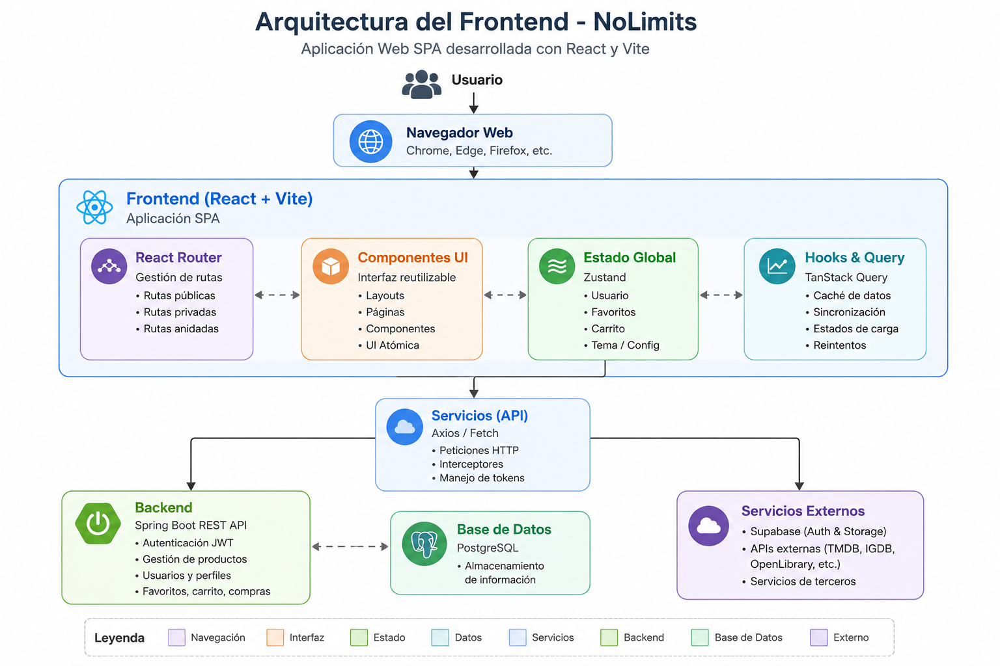
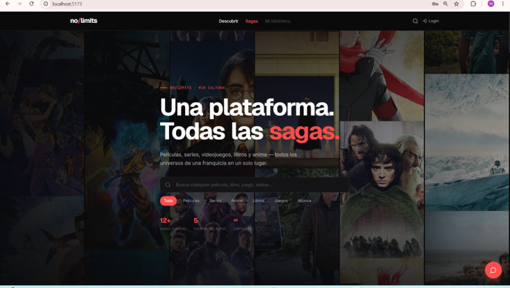
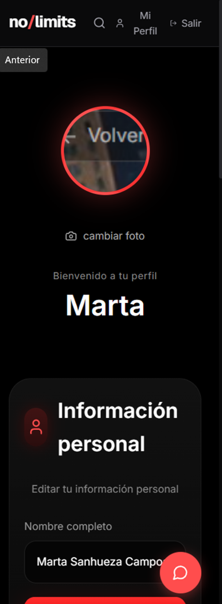
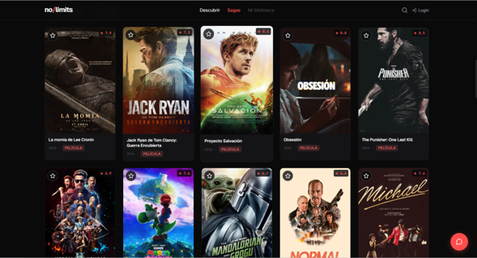

# 🚀 Frontend NoLimits

Frontend del proyecto colaborativo **NoLimits**, desarrollado con **React** como parte del proyecto de titulación de **Analista Programador en Duoc UC**.

> Este repositorio documenta mi participación en el desarrollo del frontend, reconociendo el trabajo colaborativo realizado por todo el equipo.


---

# 📑 Contenido

- 📖 Descripción
- 🤝 Proyecto colaborativo
- 👥 Equipo de desarrollo
- 👩‍💻 Mi participación
- 🛠 Tecnologías utilizadas
- ✨ Funcionalidades principales
- 🏗 Arquitectura
- 📸 Capturas del sistema
- 🚀 Instalación
- 🧪 Calidad del software
- 🌱 Aprendizajes
- 🙏 Agradecimientos
- 📄 Licencia

---

# 📖 Descripción

NoLimits es una plataforma web desarrollada para centralizar información relacionada con películas, series, videojuegos y otras sagas en un solo lugar.

El frontend fue construido con **React** y **Vite**, ofreciendo una interfaz moderna, responsiva y conectada mediante una API REST al backend desarrollado en Spring Boot.

Este repositorio corresponde al **frontend del proyecto** y documenta mi participación dentro del equipo de desarrollo.

---

# 🤝 Proyecto colaborativo

Este proyecto fue desarrollado por un equipo de estudiantes durante el proceso de titulación de **Duoc UC**.

Este repositorio representa mi participación dentro del proyecto, respetando y reconociendo el trabajo realizado por todos los integrantes del equipo.

El desarrollo de NoLimits fue posible gracias al trabajo colaborativo, la comunicación constante y el compromiso de cada uno de sus participantes.

---

# 👥 Equipo de desarrollo

- **Marta Sanhueza**  
  https://github.com/mesc1980

- **James Videla**  
  https://github.com/JamesAVT

- **Christian Troncoso**  
  https://github.com/SimonKaiak

---

# 👩‍💻 Mi participación

Dentro de este proyecto participé principalmente en:

- Desarrollo y mejora de componentes utilizando React.
- Implementación de nuevas vistas y funcionalidades de la aplicación.
- Integración del frontend con la API REST desarrollada en Spring Boot.
- Implementación de autenticación y gestión de sesiones mediante Supabase.
- Desarrollo y mantenimiento de formularios, validaciones y experiencia de usuario (UX).
- Corrección de errores, optimización y refactorización de código.
- Desarrollo de pruebas unitarias y pruebas End-to-End utilizando Vitest y Playwright.
- Trabajo colaborativo mediante Git y GitHub.

---

# 🛠 Tecnologías utilizadas

| Categoría | Tecnologías |
|------------|-------------|
| Lenguaje | JavaScript (ES6+) |
| Framework | React 18 |
| Build Tool | Vite |
| Enrutamiento | React Router |
| Estado Global | Zustand |
| Consultas | TanStack Query |
| Estilos | Bootstrap, CSS |
| Autenticación | Supabase Authentication |
| Pruebas | Vitest, Playwright |
| Calidad | ESLint |
| Control de versiones | Git y GitHub |

---

# ✨ Funcionalidades principales

El frontend proporciona una interfaz moderna para interactuar con todas las funcionalidades de la plataforma.

Entre ellas destacan:

- 👤 Registro e inicio de sesión.
- 🔐 Autenticación mediante Supabase.
- 🎬 Exploración de películas, series y videojuegos.
- 🔍 Búsqueda de productos.
- ❤️ Gestión de favoritos.
- 👤 Administración del perfil del usuario.
- 🛒 Gestión del carrito de compras.
- 🤖 Integración con chatbot inteligente.
- 📱 Diseño responsivo para distintos dispositivos.

---

# 🏗 Arquitectura

La siguiente imagen representa la arquitectura general del frontend de **NoLimits**, desarrollado con **React** y **Vite**, comunicándose mediante una API REST con el backend implementado en Spring Boot.

<p align="center">
  
</p>

La arquitectura del frontend está organizada mediante componentes reutilizables, rutas protegidas, servicios para el consumo de APIs y una separación clara entre la interfaz de usuario y la lógica de negocio.

---

# 📸 Capturas del sistema

## 🏠 Página principal

La página principal permite explorar películas, series, videojuegos y diferentes sagas mediante una interfaz moderna y responsiva.

<p align="center">
  
</p>

---

## 🔐 Inicio de sesión

La autenticación permite acceder mediante correo electrónico o utilizando una cuenta de Google gracias a la integración con Supabase Authentication.

<p align="center">
  
    
---

## 👤 Perfil del usuario

Los usuarios pueden administrar su información personal, actualizar su fotografía y modificar sus datos de perfil.

<p align="center">

</p>

---

## 📦 Gestión de productos

Vista destinada a la administración y visualización de productos disponibles dentro de la plataforma.

<p align="center">

</p>

---

# 🚀 Instalación

## Requisitos

Antes de ejecutar el proyecto asegúrate de contar con:

- Node.js 20 o superior
- npm
- Git

## Clonar el repositorio

```bash
git clone https://github.com/mesc1980/NoLimits-Front.git
```

## Acceder al proyecto

```bash
cd NoLimits-Front
```

## Instalar dependencias

```bash
npm install
```

## Ejecutar la aplicación

```bash
npm run dev
```

Una vez iniciado el servidor, el frontend estará disponible en:

```text
http://localhost:5173
```

---

# 🧪 Calidad del software

Durante el desarrollo del proyecto se aplicaron distintas estrategias para asegurar la calidad del software.

Entre ellas destacan:

- Desarrollo de pruebas unitarias con Vitest.
- Pruebas End-to-End mediante Playwright.
- Validación del consumo de APIs REST.
- Uso de ESLint para mantener un código limpio.
- Integración con Supabase Authentication.
- Trabajo colaborativo mediante Git y GitHub.

---

# 🌱 Aprendizajes

Este proyecto fortaleció mis conocimientos en:

- Desarrollo de aplicaciones SPA utilizando React.
- Consumo de APIs REST.
- Gestión de estado con Zustand.
- Manejo de rutas mediante React Router.
- Integración con Supabase.
- Desarrollo de interfaces responsivas.
- Implementación de pruebas automatizadas.
- Trabajo colaborativo utilizando Git y GitHub.

---

# 🙏 Agradecimientos

Este proyecto fue posible gracias al trabajo colaborativo desarrollado durante el proceso de titulación.

Agradezco especialmente a mis compañeros de equipo por su compromiso, disposición para colaborar y por todos los aprendizajes compartidos durante el desarrollo de NoLimits.

Esta experiencia reafirmó la importancia del trabajo en equipo, la comunicación y el desarrollo colaborativo de software.

---

# 📄 Licencia

Este repositorio tiene fines académicos y forma parte del proyecto de titulación desarrollado en Duoc UC.

El código se publica como muestra de mi participación en el proyecto y con fines de portafolio profesional.
